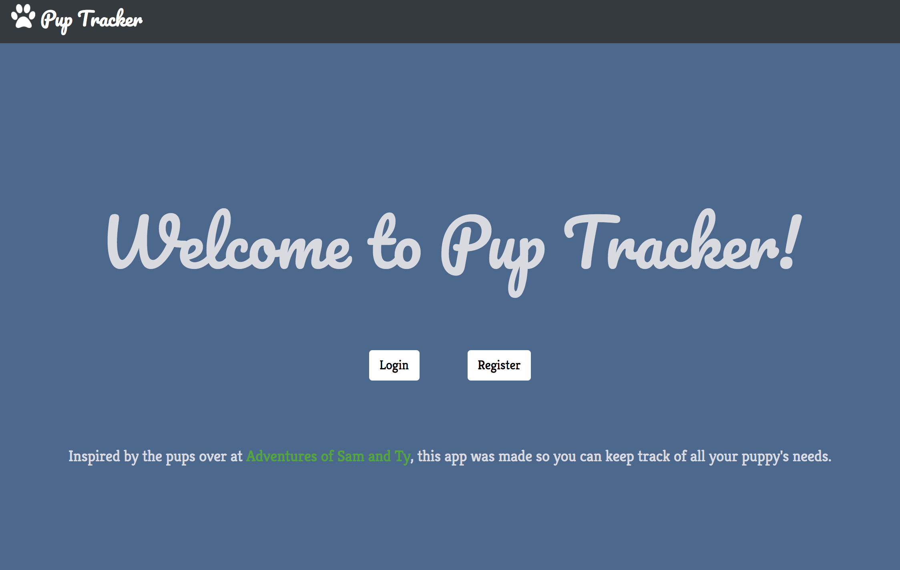
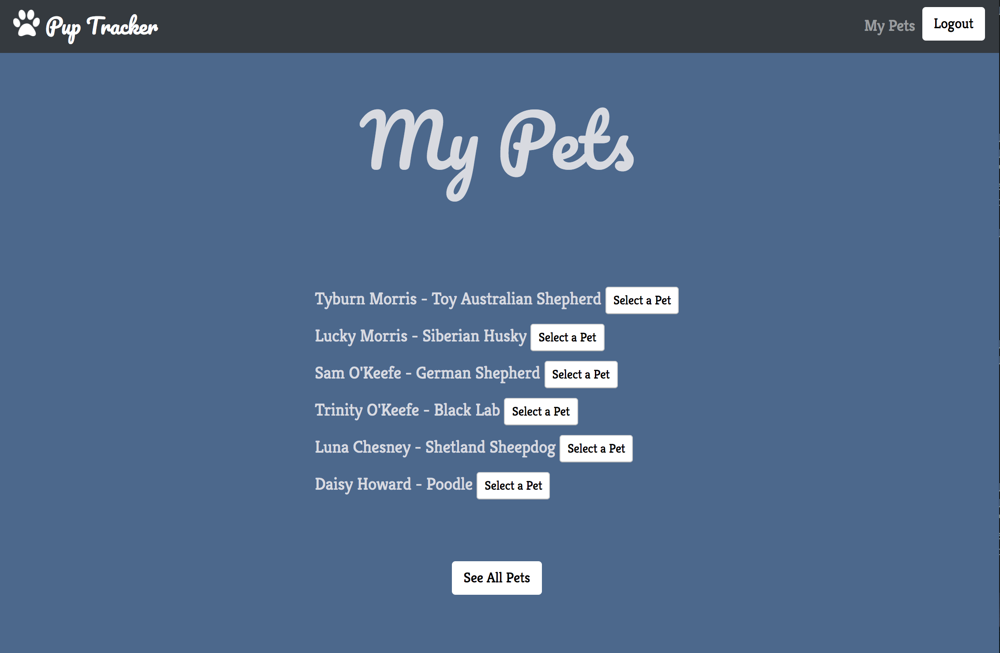
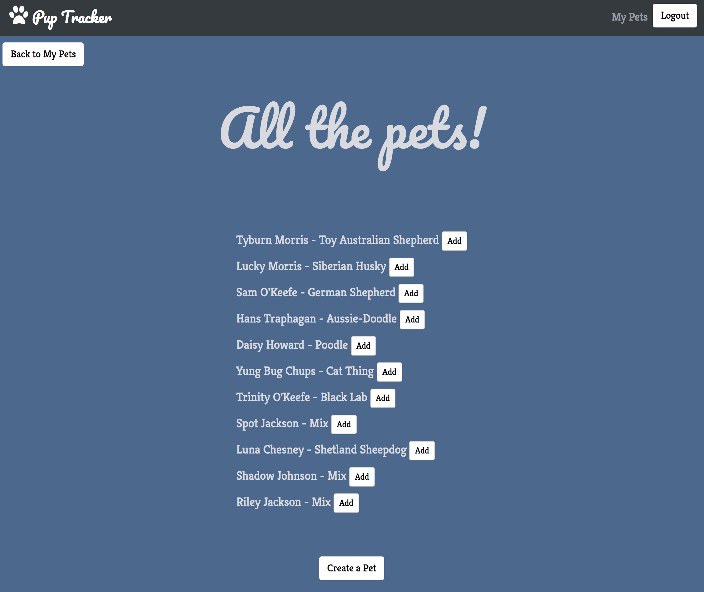
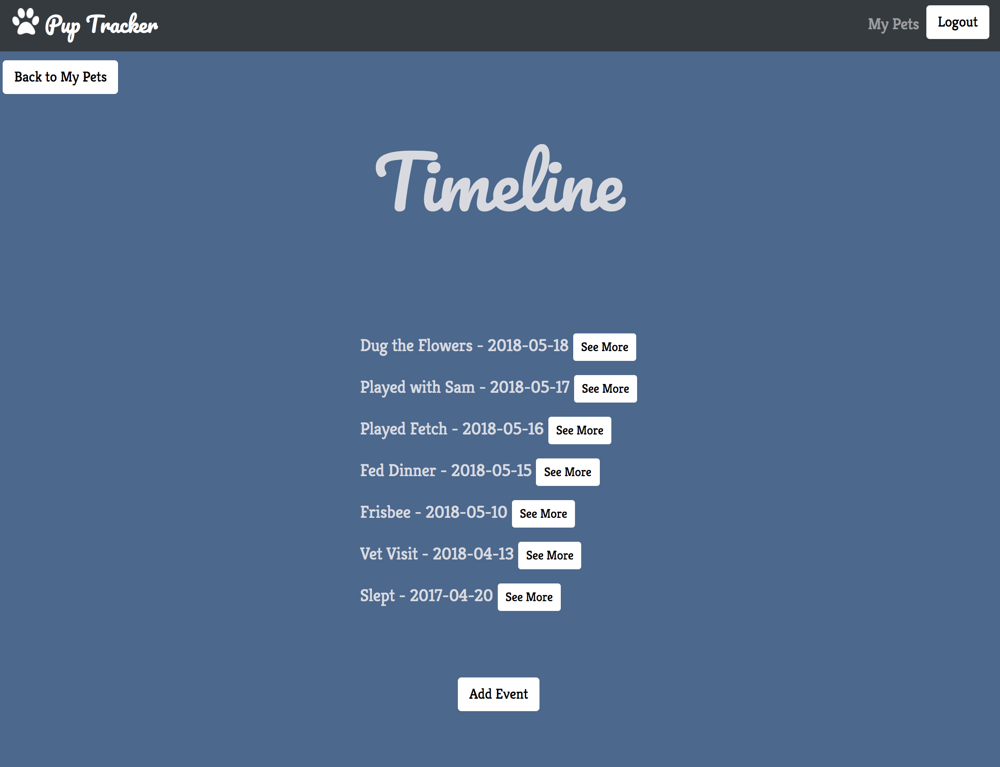

# Back End Capstone: Pup Tracker
This is my back-end capstone project for Nashville Software School. The app allows the user to login and create pet profiles for each of their pets, and keep track of data like how much food he or she ate, when he or she went to the vet, and how much he or she weighs. In addition to that, you can create a pet profile and have a different user add it to her or her household to see/add events to the pet timeline. 

## Getting Started

First, you'll need to clone the project to your machine: 
```
$ git clone https://github.com/sarahmorris926/Pup-Tracker.git
```

Next, need to install the dependencies included in the `package.json` file. 
```
npm install
```

In addition, you'll have to install node and sass (which were installed globally on my machine): 
```
npm install node sass
```

Next, you'll find a `.env.example` file in the root of this project. Create a `.env` file and add the correct contents: 
```
PORT=<port number>
NODE_ENV="<development or testing etc>"
```
My project was done with `PORT 3000` so my examples will use `localhost:3000/` as the URL. 

## Using

First, click either "Login" or "Register" in order to get started


You can see all the pets in your household that you either (a) own, or (b) are currently taking care of for a friend or client. From here, you can go to view All Pets if you need to add a pre-existing pet profile to your household, or select an active pet. 



Once you select an activce pets from the "My Pets" page, you can see his or her timeline. This will show any events you've added, in order of the date it happened. If you add something from the past, it will show up from the date of event (not the date you added it). You can add a new event to the timeline from here, or see details about each event. This is most useful when you're trying to update all pet owners/caretakers on something that happened that everyone needs to be aware of. 




## Built With
* [AngularJS](https://docs.angularjs.org/guide) - Used for the client-side of this project 
* [NodeJS](https://nodejs.org/en/docs/) - Used for building the server-side of this project
* [Sequelize](http://docs.sequelizejs.com/) - ORM used for SQL, access to the PostgreSQL database
* [PostgreSQL](https://www.postgresql.org/) - Database relational system, used for accessing and housing the database 
* [Passport](http://www.passportjs.org/) - Used for user authentication and maintaining an authorized state
* [Bootstrap](https://getbootstrap.com/) - Used for styling the elements on the app

## License
This project is licensed under the MIT License - see the [LICENSE.md](LICENSE.md) file for details
